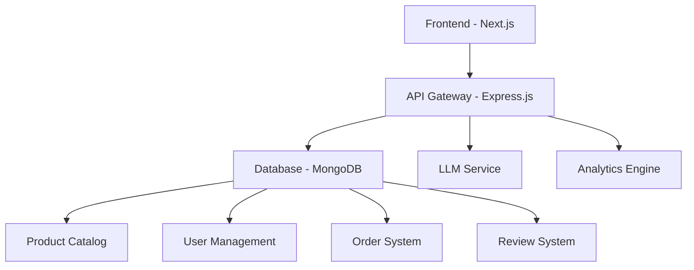
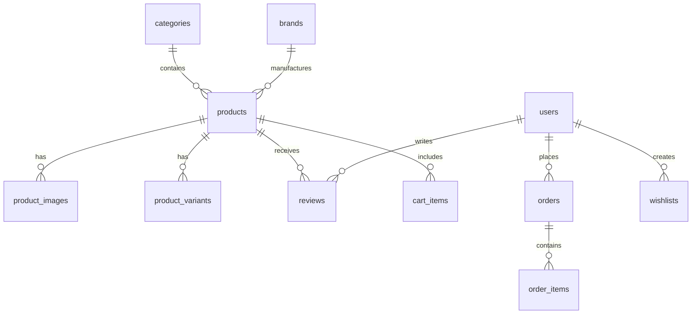

# 🛒 SmartCartia - AI-Powered E-Commerce Platform

<div align="center">

[](https://nextjs.org/)
[](https://reactjs.org/)
[](https://mongodb.com/)
[](https://nodejs.org/)
[](https://expressjs.com/)
[](https://tailwindcss.com/)
[](https://www.typescriptlang.org/)

</div>

<p align="center">
  
</p>

## 🌟 Overview

**SmartCartia** is a cutting-edge, AI-powered e-commerce platform that revolutionizes online shopping experiences. Built with modern technologies and advanced AI capabilities, it delivers intelligent product recommendations, seamless user experiences, and enterprise-grade performance.

### ✨ Key Features

🤖 **AI-Powered Intelligence**
- Advanced Large Language Model integration for intelligent product recommendations
- Natural language product search and discovery
- Personalized shopping experiences based on user behavior
- Smart product categorization and matching

🛍️ **Complete E-Commerce Solution**
- Full product catalog management with advanced filtering
- Multi-category product organization
- Shopping cart and wishlist functionality
- Order management and tracking system
- User account management and profiles

💡 **Modern User Experience**
- Responsive design for all devices
- Dark/Light theme support
- Advanced search and filtering capabilities
- Real-time inventory management
- Interactive product galleries

📊 **Analytics & Insights**
- Product interaction tracking
- User behavior analytics
- Sales performance metrics
- Inventory management insights

🔒 **Enterprise Security**
- Secure user authentication
- Data encryption and protection
- GDPR compliant data handling
- Secure API endpoints

## 🏗️ Architecture



## 🚀 Technology Stack

### Frontend
- **Framework:** Next.js 14 with App Router
- **UI Library:** React 18 with TypeScript
- **Styling:** TailwindCSS + Radix UI Components
- **State Management:** React Hooks + Context API
- **Form Handling:** React Hook Form with Zod validation

### Backend
- **Runtime:** Node.js 18+
- **Framework:** Express.js with RESTful APIs
- **Database:** MongoDB 6.0+ with Mongoose connection pooling
- **ORM:** Mongoose Models & Service Layer
- **Authentication:** bcrypt for password hashing

### AI & Machine Learning
- **LLM Integration:** Advanced Language Model APIs
- **Product Recommendations:** Intelligent matching algorithms
- **Search:** Natural language processing
- **Analytics:** User behavior tracking

### DevOps & Infrastructure
- **Development:** Hot reload with nodemon
- **Package Manager:** npm/pnpm
- **Environment:** Docker-ready configuration
- **Database:** MongoDB with migration/seeding (migrate-mongo)

## 📋 Prerequisites

Before you begin, ensure you have the following installed:

- **Node.js** 18.0 or higher
- **npm** or **pnpm** package manager
- **MongoDB** 6.0 or higher
- **Git** for version control

## ⚡ Quick Start

### 1. Clone the Repository

```bash
git clone https://github.com/nihal07g/SmartCartia-AI-Powered-E-Commerce-Platform.git
cd SmartCartia-AI-Powered-E-Commerce-Platform
```

### 2. Install Dependencies

```bash
npm install
```

### 3. Database Setup

#### Start MongoDB Locally

```bash
# Start MongoDB server (default port 27017)
mongod --dbpath /path/to/your/data
```

#### Configure MongoDB Connection

Set your MongoDB URI in `.env.local`:

```env
MONGODB_URI=mongodb://localhost:27017/smartcartia
```

#### Run Migrations & Seed Data

```bash
# Run database migrations
npx migrate-mongo up

# Seed initial data
node db/seedData.js
```

### 4. Environment Configuration

Create a `.env.local` file in the root directory:

```env
# Server Configuration
FRONTEND_PORT=3000
BACKEND_PORT=3001
NEXT_PUBLIC_APP_URL=http://localhost:3000
NEXT_PUBLIC_BACKEND_URL=http://localhost:3001


# Database Configuration
MONGODB_URI=mongodb://localhost:27017/smartcartia

# AI Configuration
LLM_API_KEY=your_llm_api_key_here
LLM_MODEL=advanced-llm-model

# Security
JWT_SECRET=your-super-secret-jwt-key
BCRYPT_ROUNDS=12

# Environment
NODE_ENV=development
```

### 5. Start Development Servers

```bash
# Start both frontend and backend servers
npm run dev
```

The application will be available at:
- **Frontend:** http://localhost:3000
- **Backend API:** http://localhost:3001

## 📖 API Documentation

### Authentication Endpoints

| Method | Endpoint | Description |
|--------|----------|-------------|
| POST | `/api/auth/register` | User registration |
| POST | `/api/auth/login` | User login |
| POST | `/api/auth/logout` | User logout |
| GET | `/api/auth/profile` | Get user profile |

### Product Endpoints

| Method | Endpoint | Description |
|--------|----------|-------------|
| GET | `/api/products` | Get all products with filtering |
| GET | `/api/products/:id` | Get product by ID |
| GET | `/api/products/featured` | Get featured products |
| GET | `/api/products/bestsellers` | Get bestselling products |
| GET | `/api/products/search?q=term` | Search products |
| GET | `/api/products/:id/related` | Get related products |

### Category Endpoints

| Method | Endpoint | Description |
|--------|----------|-------------|
| GET | `/api/products/categories` | Get all categories |
| GET | `/api/categories/:id` | Get category details |
| GET | `/api/categories/:id/products` | Get products by category |

### AI-Powered Features

| Method | Endpoint | Description |
|--------|----------|-------------|
| POST | `/api/find-my-product` | AI product recommendations |
| POST | `/api/review-emotions` | Analyze review sentiment |
| POST | `/api/social-sentiment` | Social media sentiment analysis |

### Example API Requests

#### Get Products with Filtering

```bash
curl "http://localhost:3001/api/products?category=Electronics&limit=10&featured=true"
```

#### AI Product Search

```bash
curl -X POST "http://localhost:3001/api/find-my-product" \
  -H "Content-Type: application/json" \
  -d '{"query": "budget wireless earbuds under 5000 rupees"}'
```

## 🗄️ Database Schema

### Core Tables

- **products** - Product catalog with specifications
- **categories** - Hierarchical product categories
- **users** - Customer accounts and profiles
- **orders** - Order management and tracking
- **reviews** - Product reviews and ratings
- **shopping_cart** - Shopping cart functionality
- **wishlists** - User wishlists

### Advanced Features

- **product_analytics** - User interaction tracking
- **product_images** - Image management
- **product_variants** - Size, color variations
- **order_addresses** - Shipping and billing addresses

<details>
<summary>📊 Database ERD</summary>



</details>

## 🎨 UI Components

SmartCartia uses a comprehensive design system built with:

- **Radix UI** - Accessible, unstyled components
- **TailwindCSS** - Utility-first CSS framework
- **Lucide React** - Beautiful, customizable icons
- **Custom Components** - Tailored for e-commerce needs

### Key Components

- `ProductGrid` - Responsive product display
- `CategoryShowcase` - Featured category sections
- `SearchBar` - Advanced search functionality
- `ShoppingCart` - Complete cart management
- `UserProfile` - Account management interface

## 🔧 Configuration

### Environment Variables

| Variable | Description | Default |
|----------|-------------|---------|
| `DB_HOST` | Database host | localhost |
| `DB_PORT` | Database port | 5432 |
| `DB_NAME` | Database name | smartcartia_db |
| `LLM_API_KEY` | LLM service API key | - |
| `LLM_MODEL` | LLM model name | advanced-llm-model |

### Custom Configuration

The platform supports extensive customization through:

- Theme configuration in `tailwind.config.js`
- API routes in `server/routes/`
- Database models in `models/`
- Frontend components in `components/`

## 🚀 Deployment

### Production Build

```bash
# Build the application
npm run build

# Start production server
npm start
```

### Docker Deployment

```dockerfile
FROM node:18-alpine
WORKDIR /app
COPY package*.json ./
RUN npm ci --only=production
COPY . .
RUN npm run build
EXPOSE 3000 3001
CMD ["npm", "start"]
```

### Environment Setup

For production deployment:

1. Set up MongoDB database
2. Configure environment variables
3. Run database migrations & seed data
4. Start the application

## 📊 Performance Features

- **Database Optimization** - Connection pooling, indexed queries
- **Caching** - Strategic caching for API responses
- **Lazy Loading** - Optimized image and component loading
- **Code Splitting** - Efficient bundle management
- **CDN Ready** - Optimized static asset delivery

## 🔐 Security Features

- **Input Validation** - Comprehensive data validation
- **SQL Injection Protection** - Parameterized queries
- **XSS Prevention** - Content sanitization
- **Rate Limiting** - API abuse prevention
- **Secure Headers** - Security-first configuration

## 🧪 Testing

```bash
# Run all tests
npm test

# Run specific test suites
npm run test:unit
npm run test:integration
npm run test:e2e
```

## 📈 Analytics & Monitoring

SmartCartia includes comprehensive analytics:

- **Product Performance** - View counts, conversion rates
- **User Behavior** - Shopping patterns, preferences
- **Sales Analytics** - Revenue tracking, trends
- **System Health** - API performance, error rates

## 🛠️ Development

### Project Structure

```
SmartCartia/
├── app/                    # Next.js app router pages
├── components/             # React components
├── db/                     # Database configuration
├── models/                 # Database models
├── repositories/           # Data access layer
├── server/                 # Express.js backend
├── public/                 # Static assets
├── styles/                 # Global styles
└── lib/                    # Utility functions
```

### Adding New Features

1. **Database Changes** - Update migrations in `db/migrations/`
2. **Models** - Create/update models in `models/`
3. **API Routes** - Add endpoints in `server/routes/`
4. **Frontend** - Create components in `components/`

## 🤝 Contributing

We welcome contributions! Please read our contributing guidelines:

1. Fork the repository
2. Create a feature branch
3. Make your changes
4. Add tests if applicable
5. Submit a pull request

## 📄 License

This project is licensed under the MIT License - see the [LICENSE](LICENSE) file for details.

## 🙏 Acknowledgments

- **Open Source Community** - For amazing libraries and tools
- **Design Inspiration** - Modern e-commerce platforms
- **AI Technology Partners** - For advanced LLM capabilities
- **Contributors** - Everyone who helped build this platform

## 📞 Support

For support and questions:

- **Documentation** - Check our comprehensive docs
- **Issues** - Create GitHub issues for bugs
- **Discussions** - Join community discussions
- **Email** - Contact our support team

---

<div align="center">

**Built with ❤️ for the future of e-commerce**

[](https://vercel.com/new/git/external?repository-url=https://github.com/nihal07g/SmartCartia-AI-Powered-E-Commerce-Platform)
[](https://heroku.com/deploy?template=https://github.com/nihal07g/SmartCartia-AI-Powered-E-Commerce-Platform)

</div>
